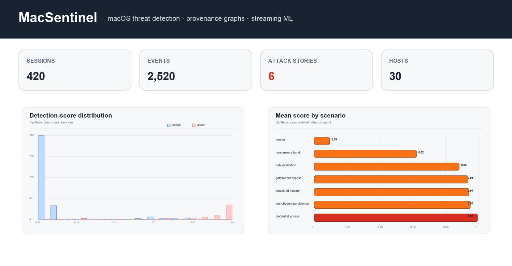
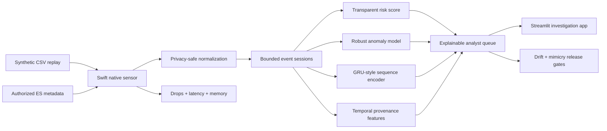

<div align="center">

# 🛡️ MacSentinel

### Privacy-preserving macOS threat detection with provenance graphs and streaming ML

[](https://support.apple.com/guide/security/welcome/web)
[](sensor-swift/)
[](https://www.python.org/)
[](https://streamlit.io/)
[](#safety-and-platform-boundary)
[](https://github.com/VinayK88/macsentinel/actions/workflows/ci.yml)

**Native telemetry · Privacy filtering · Temporal sequences · Provenance graphs · Drift · Adversarial robustness**

[Run the app](#quick-start) · [Explore notebooks](#notebook-lab) · [Review architecture](#architecture) · [Understand safety](#safety-and-platform-boundary)

</div>

---

MacSentinel is a portfolio-grade macOS security analytics lab. It converts synthetic Endpoint Security-style events into a transparent analyst queue, reconstructs process–file–network provenance, compares lightweight ML approaches, and deliberately tests how detection fails under concept drift and attacker mimicry.



## 60-second reviewer path

Short on time? Review the project in this order:

1. [Understand the macOS security problem](#why-this-project).
2. [Follow the privacy-preserving architecture](#architecture).
3. [See the analyst-facing application](#analyst-app).
4. [Open the executed security and ML notebooks](#notebook-lab).
5. [Reproduce the demo locally](#quick-start).

## Why this project

The design reflects themes visible in Apple's public security ecosystem:

- The [Endpoint Security framework](https://developer.apple.com/documentation/EndpointSecurity) exposes security-relevant system events to authorized clients.
- Apple's platform guide describes [Gatekeeper, Notarization, XProtect, and Endpoint Security event visibility](https://support.apple.com/guide/security/protecting-against-malware-sec469d47bd8/web).
- The project emphasizes on-device constraints, privacy, provenance graphs, streaming detection, explainability, drift, and adversarial evaluation.

This is an independent educational project. It is not affiliated with or endorsed by Apple.

## Architecture



## Native Swift sensor

The [MacSentinel Native Sensor](sensor-swift/) adds the systems layer that sits before the Python analytics stack:

- Swift 6 typed event ingestion and CSV replay
- Salted host, user, session, and target tokens
- Bounded queues with explicit overflow behavior
- Batched normalized JSONL output
- Zero-drop and privacy release gates
- Throughput, p50/p95 latency, peak-memory, and queue-pressure reporting
- A typed Endpoint Security metadata boundary that fails closed without explicit authorization

Its checked-in release benchmark processes all **2,520 events with zero drops**, no raw identifiers or targets in output, approximately **2,645 events/s**, **479 µs p95** privacy-normalization latency, and **11.4 MB** peak resident memory on the recorded arm64 development run. These are synthetic replay measurements, not production Endpoint Security claims.

## Analyst app

The Streamlit app is summary-first and useful on first load:

- Filters for host, scenario, and decision threshold
- Session/event/alert KPIs and unseen-host holdout metrics
- Score distributions, scenario alert rates, and time trends
- Click-through process–file–network provenance graph
- Ordered event evidence and a bounded investigation queue
- Explicit privacy, evaluation, and platform-boundary notes
- Optional upload for authorized data already normalized to the documented CSV schema

## Notebook lab

| # | Notebook | Question | ML / visual extension |
| ---: | --- | --- | --- |
| 01 | [macOS telemetry EDA](notebooks/01_macos_telemetry_eda.ipynb) | Is the benchmark complete and representative enough to model? | Coverage matrix, scenario distribution, event timeline |
| 02 | [Provenance graph investigation](notebooks/02_provenance_graph_investigation.ipynb) | How do isolated events form an attack story? | Directed entity graph, connectivity ranking, message-passing features |
| 03 | [Streaming anomaly detection](notebooks/03_streaming_anomaly_detection.ipynb) | Which sessions deserve scarce analyst attention? | Robust-z baseline, logistic benchmark, queue-capacity thresholding |
| 04 | [GRU sequence detection](notebooks/04_gru_sequence_detection.ipynb) | Does event order add detection value? | Inspectable GRU cell, learned detection head, embedding projection |
| 05 | [Temporal graph ML](notebooks/05_temporal_graph_ml.ipynb) | Does provenance context improve classification? | Iterative message passing, host holdout, coefficient explanations |
| 06 | [Adversarial robustness and drift](notebooks/06_adversarial_robustness_and_drift.ipynb) | Will the detector survive product change and mimicry? | PSI monitoring, stress evaluation, privacy and release gates |

The notebooks contain **41 executed code cells and 13 embedded visualizations**. Each uses a host-separated split where evaluation applies, so the same Mac never appears in both training and test data.

## Quick start

```bash
git clone https://github.com/VinayK88/macsentinel.git
cd macsentinel

python -m venv .venv
source .venv/bin/activate
pip install -r requirements.txt

streamlit run app.py
```

For the notebooks:

```bash
jupyter lab notebooks
```

Rebuild and execute every notebook:

```bash
python build_notebooks.py
python validate_notebooks.py
python -m unittest discover -s tests -v
```

Compile and verify the native sensor:

```bash
swift run --package-path sensor-swift --configuration release \
  macsentinel-sensor self-test \
  --input data/synthetic_macos_events.csv
```

## Detection stories

The fixture contains 420 sessions across 30 pseudonymous Macs. Six attack stories are mixed with benign user and administrator activity:

| Scenario | Observable sequence | ATT&CK examples |
| --- | --- | --- |
| Download and execute | Browser → download → shell → permission change → execution → callback | T1105, T1059, T1222, T1204 |
| LaunchAgent persistence | Download → shell → plist write → `launchctl` → helper | T1543.001 |
| Gatekeeper bypass | Download → archive → attribute change → bypass → execution | T1553.001 |
| Credential access | Shell → keychain/SSH access → outbound connection | T1555.001, T1552.004, T1041 |
| Ransomware-like burst | Document lure → shell → rapid multi-directory writes | T1566, T1204, T1486 |
| Data exfiltration | Discovery → archive → repeated upload → cleanup | T1083, T1560, T1041, T1070 |

All domains use the reserved `.example` namespace, and all filenames are inert strings.

## Honest model card

| Dimension | Decision |
| --- | --- |
| Intended use | Reproducible portfolio research and defensive detection prototyping |
| Prohibited use | Employee surveillance, autonomous blocking, offensive execution, or claims of production efficacy |
| Evaluation | Synthetic labels; entity-separated holdout by host |
| Explainability | Transparent rule score, feature coefficients, provenance subgraph, ordered evidence |
| Known failure | Mimicry can suppress obvious signals and sharply reduce recall |
| Drift response | PSI above an illustrative threshold blocks release pending investigation |
| Privacy | Pseudonymous IDs; no contents, secrets, clipboard, messages, or credentials |

## Safety and platform boundary

Apple's Endpoint Security entitlement is restricted. MacSentinel therefore does **not** create a privileged `es_client_t` in the public build. The Swift package ships a deterministic replay source plus an executable, typed boundary through which an approved Endpoint Security client can supply authorized metadata.

Before using real telemetry:

1. Obtain required organizational approval and Apple entitlements.
2. Collect the minimum event metadata needed for a stated security purpose.
3. Hash or tokenize identifiers and enforce short retention.
4. Never collect file contents, clipboard contents, message bodies, passwords, or secrets.
5. Require analyst review before containment or blocking actions.

## Project structure

```text
macsentinel/
├── sensor-swift/                # Swift ingestion, privacy, buffering, benchmarks
├── app.py                       # Streamlit analyst workbench
├── core.py                      # telemetry, features, models, stress tests
├── visuals.py                   # dependency-light PNG chart renderer
├── data/
│   └── synthetic_macos_events.csv
├── notebooks/                   # six executed notebooks
├── assets/
│   └── macsentinel-dashboard.png
├── tests/                       # Python core and app smoke tests
├── build_notebooks.py
├── validate_notebooks.py
└── render_preview.py
```
