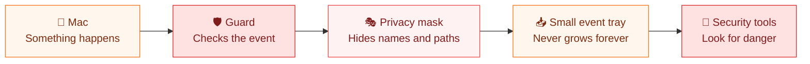
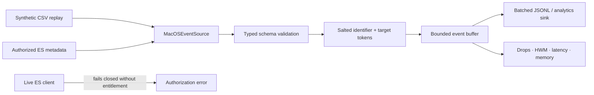

# MacSentinel Native Sensor

A Swift 6 package that turns replayed or explicitly authorized macOS security metadata into bounded, privacy-filtered events for MacSentinel.

[](Package.swift)
[](Package.swift)
[](#endpoint-security-boundary)

## Explain it like I'm 5

Imagine your Mac is a house and MacSentinel is a tiny, careful security guard.

When something happens in the house—like a program opening a file—the guard writes a small note. Before sharing the note, the guard replaces private names and addresses with secret labels. The guard then puts the safe note in a tray so a detective can look for unusual behavior later.



### A tiny example

Suppose a practice event says:

> **Vinay's Mac** opened `/Users/vinay/SecretPlans.txt` using `/Applications/Preview.app`.

MacSentinel turns it into a safer note like:

> **host_8a12…** opened **file_91bc…** using `Preview.app`.

The detective can still tell that one computer opened one file with Preview, but the real computer name and file location are not exposed.

### What it does—and does not do

- **It does:** prepare privacy-safe macOS event data for security analytics and machine-learning experiments.
- **It does:** keep its waiting tray bounded, measure performance, and report if events are dropped.
- **It does not:** read file contents, messages, passwords, clipboard data, or other secret material.
- **Today:** the public demo replays pretend events from a checked-in CSV file. Live Apple Endpoint Security collection requires Apple's entitlement, signing, and a separately reviewed adapter.

## What it proves

- Native Swift ingestion and schema validation
- Deterministic privacy tokens using salted SHA-256
- Process-basename minimization and target tokenization
- Bounded buffering with explicit `dropNewest` and `dropOldest` policies
- Batch sinks and queue high-watermark accounting
- Throughput, p50/p95 normalization latency, peak memory, and drop reporting
- A fail-closed boundary for Apple's restricted Endpoint Security entitlement
- XCTest coverage plus a dependency-free compiled self-test command

## Data path



## Build and run

From the repository root:

```bash
swift build \
  --package-path macsentinel/sensor-swift \
  --configuration release \
  --product macsentinel-sensor

swift run \
  --package-path macsentinel/sensor-swift \
  --configuration release \
  macsentinel-sensor self-test \
  --input macsentinel/data/synthetic_macos_events.csv
```

Run a benchmark and write normalized events:

```bash
export MACSENTINEL_PRIVACY_SALT="replace-with-a-deployment-specific-secret"

swift run \
  --package-path macsentinel/sensor-swift \
  --configuration release \
  macsentinel-sensor benchmark \
  --input macsentinel/data/synthetic_macos_events.csv \
  --capacity 256 \
  --batch-size 64 \
  --event-output /tmp/macsentinel-events.jsonl \
  --report /tmp/macsentinel-benchmark.json
```

The public deterministic salt is suitable only for the checked-in synthetic fixture. Authorized deployments must provide a secret salt through `MACSENTINEL_PRIVACY_SALT` or another environment variable selected with `--salt-env`.

## Measured synthetic replay

The checked-in [benchmark report](benchmarks/latest.json) was produced from a release build on arm64 macOS while writing privacy-filtered JSONL.

| Measure | Result |
| --- | ---: |
| Events read / emitted | 2,520 / 2,520 |
| Events dropped | **0** |
| Throughput | 2,645 events/s |
| p50 normalization latency | 244 µs |
| p95 normalization latency | 479 µs |
| Peak resident memory | 11.4 MB |
| Queue high-water mark | 64 / 256 |
| Raw identifiers or targets in output | **0** |

These results measure a small synthetic replay on one development machine. They do not establish Endpoint Security production capacity, kernel-to-user latency, fleet-scale reliability, or detection effectiveness.

## Privacy contract

The normalized schema deliberately excludes file contents, clipboard data, message bodies, credentials, command output, and secret material.

| Raw field | Output behavior |
| --- | --- |
| Event, host, user, session identifiers | Salted SHA-256 token with a type prefix |
| Target path/domain/resource | Kind plus salted token; raw value removed |
| Process path | Basename only, restricted character set, 96-character cap |
| Counts and flags | Bounded numeric and Boolean metadata |
| Security label/scenario | Preserved for the synthetic benchmark only |

The pipeline re-encodes every normalized event during benchmarking and fails if a raw identifier or target is observed in output.

## Backpressure contract

`BoundedEventBuffer` never grows beyond its configured capacity:

- `dropNewest` preserves already-queued evidence and rejects the incoming event.
- `dropOldest` preserves the newest evidence by evicting the oldest queued item.
- Every overflow increments `droppedCount`.
- Every run records the queue high-water mark.
- The CLI exits non-zero if any event is dropped during its benchmark or replay command.

Production deployments should export these counters to monitoring and define an explicit operational response before enabling live collection.

## Endpoint Security boundary

The package does not create an `es_client_t`, request an entitlement, install a system extension, or subscribe to live events. Public CI uses `ReplayCSVEventSource`.

`EndpointSecurityMetadataSource` is the typed handoff for an organization that already has:

1. Apple's Endpoint Security entitlement and required signing configuration.
2. A documented security purpose and approved deployment process.
3. A minimal event subscription and retention policy.
4. A separately reviewed adapter that converts authorized metadata to `RawMacOSEvent`.

`LiveEndpointSecuritySource.requireAuthorization()` fails closed to make this boundary executable rather than aspirational.

## Verification

```bash
swift test --package-path macsentinel/sensor-swift --configuration release
```

GitHub Actions runs the XCTest suite and a complete replay benchmark on macOS. The local `self-test` command covers CSV parsing, both overflow policies, the entitlement failure path, salted tokenization, the full fixture count, zero drops, privacy leakage, and performance metrics without requiring a test framework.

## Package map

```text
sensor-swift/
├── Package.swift
├── Sources/
│   ├── MacSentinelSensor/
│   │   ├── EventModels.swift
│   │   ├── EventSources.swift
│   │   ├── PrivacyFilter.swift
│   │   ├── BoundedEventBuffer.swift
│   │   └── SensorPipeline.swift
│   └── MacSentinelSensorCLI/main.swift
├── Tests/MacSentinelSensorTests/SensorTests.swift
└── benchmarks/latest.json
```
